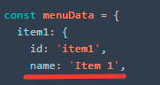
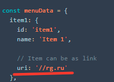
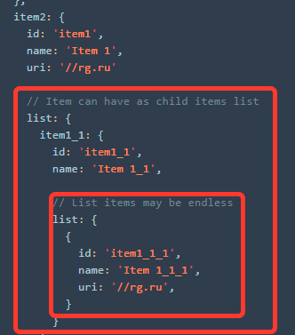

# Vue simple menu
Vue component for fast create simple menu block

[](https://standardjs.com)

## Для кого?
Простое и легкое меню с набором основного функционала, которого хватает в 80% случаев:
  * Элементы меню с прямой ссылкой
  * Элементы меню как раскрывающийся каталог
  * Бесконечная вложенность
  * __В процессе:__ _Стилизация внешнего вида (можно выбрать готовую, либо добвить самому)_

# Installation

## ES6 via npm
```sh
npm i vue-simple-menu -D
```

## Component as global in browser
in progress

# Usage

Import component to your code

For example, we have menu container

```html
<div id="menu"></div>
```

Для формирования меню, в него нужно передать данные определенного формата (то, как мы их получаем отдается на откуп разработчику)

Params

| Name | Type | Description |
|:-- |:-- |:-- |
| id | string | Identificator for item. It is link to itself id key (figure 1)<br>Идентификатор в любом формате, какой вы сами придумаете |
| name | string | Name or title for menu item element (figure 2) |
| uri | string | Add link to item element (figure 3) |
| list | array: object | Add children elements to item (figure 4)<br>Структура вложенных объектов повторяет основную родительску |

__Pictures for data params__

__figure 1__ Identificator for item. It is link to itself id key  


__figure 2__ Name or title for menu item element  


__figure 3__ Add link to item element  


__figure 4__ Add children elements to item  


Example

```js
const menuData = {
  item1: {
    id: 'item1',
    name: 'Item 1',

    // Item can be as link
    uri: '//rg.ru'
  },
  item2: {
    id: 'item1',
    name: 'Item 1',
    uri: '//rg.ru'

    // Item can have as child items list
    list: {
      item1_1: {
        id: 'item1_1',
        name: 'Item 1_1',

        // List items may be endless
        list: {
          {
            id: 'item1_1_1',
            name: 'Item 1_1_1',
            uri: '//rg.ru',
          }
        }
      }
      ...
    }
  }
  ...
}
```

And mount to container our component

```js
import VueSimpleMenu from 'vue-simple-menu'

new Vue(VueSimpleMenu).$mount(document.getElementById('menu'))
```

Done, we can use it.
