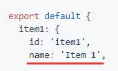
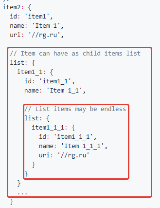

# Vue simple menu

Vue component for fast create simple menu block

> I will be glad to correct the inaccuracy of the my English 😄

[Описание на русском языке](README.ru.md)

[](https://travis-ci.org/RGRU/vue-simple-menu)
[](https://standardjs.com)
[](https://badge.fury.io/js/vue-simple-menu)

## For whom?

Simple and easy menu with a set of basic functionality, which is enought in 80% of cases:
  * Menu items with direct link (href="/url.html")
  * Compatibility with vue-router
  * Menu items can be toggle expand
  * Menu items with infinity nesting
  * Stylize as you want (you can select default or make and require own style)

# Installation and usage

## ES6 via npm

```sh
npm i vue-simple-menu -D
```

### Usage

For example, we have app container, and menu component inside

```html
<div id="app">
  <vue-simple-menu :raw-menu-data="rawMenuData"></vue-simple-menu>
</div>
```

For building menu, you need pass to `raw-menu-data` data of menu, must be of a certain format  

Params

| Name | Type | Description |
|:-- |:-- |:-- |
| id | string | ID for item. It is link to itself id key (figure 1)<br>ID format as you want |
| name | string | Name or title for menu item element (figure 2) |
| uri | string | Add link to item element (figure 3) |
| list | array: object | Add children elements to item (figure 4)<br>The structure of nesting objects repeats the main parent |

__Pictures for data params__

__figure 1__ Identificator for item. It is link to itself id key  


__figure 2__ Name or title for menu item element  


__figure 3__ Add link to item element  


__figure 4__ Add children elements to item  


For example file rawMenuData.js

```js
export default {
  item1: {
    id: 'item1',
    name: 'Item 1',

    // Item can be as link
    uri: '//rg.ru'
  },
  item2: {
    id: 'item1',
    name: 'Item 1',
    uri: '//rg.ru',

    // Item can have as child items list
    list: {
      item1_1: {
        id: 'item1_1',
        name: 'Item 1_1',

        // List items may be endless
        list: {
          item1_1_1: {
            id: 'item1_1_1',
            name: 'Item 1_1_1',
            uri: '//rg.ru'
          }
        }
      }
      ...
    }
  }
  ...
}
```

And add imported menu component to Vue app. Menu data pass as component

```js
import Vue from 'vue'
import VueSimpleMenu from 'vue-simple-menu'

// Data for menu, may get by APi or somehow else
import rawMenuData from './rawMenuData'

// Add style for menu
require('../styles/default.sass')

// Init vue application
new Vue({
  el: '#app',
  data () {
    return {

      // Init default data for menu
      rawMenuData: {}
    }
  },
  components: {
    'vue-simple-menu': VueSimpleMenu
  }
})

// Emulate async getting menu data
setTimeout(function () {
  app.rawMenuData = rawMenuData
}, 1000)
```

## Component as global in browser

Pass to your html page scripts below

```html
<!-- Include Vue library -->
<script src="//cdn.jsdelivr.net/npm/vue"></script>

<!-- Include vue-simple-menu component -->
<script src="//unpkg.com/vue-simple-menu"></script>
```

### Usage

Add element for our application with menu

```html
<!-- Our app -->
<div id="app">
  <vue-simple-menu :raw-menu-data="rawMenuData"></vue-simple-menu>
</div>
```

And use in you scripts some as:

```js
// Data for menu, may get by APi or somehow else
import rawMenuData from './rawMenuData'

// Init vue app with menu component in template
new Vue({
  el: '#app',
  data () {
    return {
      rawMenuData: menuData
    }
  }
})
```

## Usage with Vue Router

You can use simple menu with [vue router](https://router.vuejs.org/en/essentials/getting-started.html) links

Just add value `vueRouter: true` in rawMenuData, and items with this value will be work as vue-router link

Is implied, the vue router is already connected in your app script

Example below

```js
articles: {
  id: 'articles',
  name: 'Статьи',
  uri: '/articles/list',

  // Add value for associate this item with vue-router
  vueRouter: true,
  ...
}
```

Done!

## Stylize

You can use default styles for menu. Just require sass or css file to your project from styles folder in src. You should setup webpack config for processing styles (for example [css-loader](https://github.com/webpack-contrib/css-loader))

Example

```js
// Path where put styles in your own project
require('../styles/default.sass')
```

Or pass default style from CDN

Example

```html
<link href="//unpkg.com/vue-simple-menu/dist/styles/vue-simple-menu.default.min.css" rel="stylesheet" />
```
