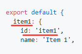
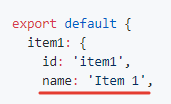
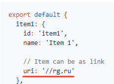
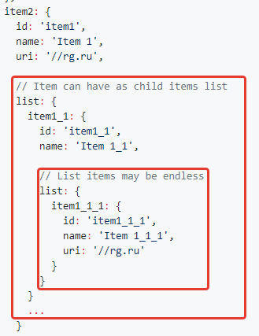

# Vue simple menu

Компонент vue для быстрого создания блока с меню

[](https://travis-ci.org/RGRU/vue-simple-menu)
[](https://standardjs.com)
[](https://badge.fury.io/js/vue-simple-menu)

## Для кого?

Самое легкое меню, покрывающее своей функциональностью 80% случаев его использования:
  * По клику на элемент меню - переход на другую страницу
  * Совместимость с vue router (по клику на элемент, срабатывает хук роутера)
  * Элемент меню как раскрывающийся список подменю (без перехода по клику)
  * Вложенность подменю может быть бесконечной
  * Можно стилизовать блок как вам хочется или использовать как отправную точку стилизацию из этого пакета

# Установка и использование

## ES6 через npm

```sh
npm i vue-simple-menu -D
```

### Использование

Например у нас есть контейнер `app` и компонент с меню внутри него

```html
<div id="app">
  <vue-simple-menu :raw-menu-data="rawMenuData"></vue-simple-menu>
</div>
```

Для создания меню нам нужно передать в свойство `raw-menu-data` данные для меню. Причем они должны быть определенного формата, описанного ниже

Параметры данных для меню

| Название | Тип | Описание |
|:-- |:-- |:-- |
| id | string | ID для элемента, который нужно продублировать в свойство id (изображение 1)<br>Формат id может быть любой, какой вы сами выберете |
| name | string | Название элемента меню (изображение 2) |
| uri | string | Ссылка с элемента меню (изображение 3) |
| list | array: object | Дочерние подуровни у элемента меню (изображение 4)<br>Структура дочерних объектов полностью повторяет основную родительскую |

__Изображения к параметрам данных для меню__

__Изображение 1__ ID для элемента меню  


__Изображение 2__ Название элемента меню  


__Изображение 3__ Добавление ссылки к элементу меню  


__Изображение 4__ Добавление дочерних элементов  


В итоге файл с данными получится примерно таким rawMenuData.js

```js
export default {
  item1: {
    id: 'item1',
    name: 'Item 1',

    // Элемент меню как кликабельная ссылка,
    // из-за указания этого свойства
    uri: '//rg.ru'
  },
  item2: {
    id: 'item1',
    name: 'Item 1',
    uri: '//rg.ru',

    // Элемент имеет дочерние подуровни
    list: {
      item1_1: {
        id: 'item1_1',
        name: 'Item 1_1',

        // Подуровни могут быть бесконечными
        list: {
          item1_1_1: {
            id: 'item1_1_1',
            name: 'Item 1_1_1',
            uri: '//rg.ru'
          }
        }
      }
      ...
    }
  }
  ...
}
```

Добавляем компонент меню в приложение, как компонент и передаем в него заранее подготовленные данные

```js
import Vue from 'vue'
import VueSimpleMenu from 'vue-simple-menu'

// Подготовленные данные для меню
import rawMenuData from './rawMenuData'

// Добавляем стили для меню
require('../styles/default.sass')

// Инициализация приложения
new Vue({
  el: '#app',
  data () {
    return {

      // Инициализация данных для меню по-умолчанию
      rawMenuData: {}
    }
  },

  // Добавляем компонент
  components: {
    'vue-simple-menu': VueSimpleMenu
  }
})

// Эмулируем асинхронное получение данных для меню
setTimeout(function () {
  app.rawMenuData = rawMenuData
}, 1000)
```

## Использование компонента напрямую в брузере

Просто поместите на вашу страницу скрипты с библиотекой vue и самим компонентом меню

```html
<!-- Include Vue library -->
<script src="//cdn.jsdelivr.net/npm/vue"></script>

<!-- Include vue-simple-menu component -->
<script src="//unpkg.com/vue-simple-menu"></script>
```

### Использование

Добавьте компонент в ваше приложение

```html
<!-- Our app -->
<div id="app">
  <vue-simple-menu :raw-menu-data="rawMenuData"></vue-simple-menu>
</div>
```

В скриптах используйте так:

```js
// Подготовленные данные для меню
import rawMenuData from './rawMenuData'

// Инициализируем компонент меню вместе с данными (он уже подключен глобально, отдельно его никак подключать не надо)
new Vue({
  el: '#app',
  data () {
    return {
      rawMenuData: menuData
    }
  }
})
```
> Важное примечание. При использовании vue-simple-menu, подключая через тег script, он подключается глобально и поэтому может быть использован корректно только один на странице

## Использование вместе с vue router

Вы можете использовать vue-simple-menu вместе с [vue router](https://router.vuejs.org/en/essentials/getting-started.html)

Просто добавьте свойство `vueRouter: true` в подготавливаемые данные для меню, и тогда по клику на этот элемент, будет срабатывать событие, перехваченное vue router.

> Подразумевается, что vue router уже подключен у вас на странице

Пример

```js
articles: {
  id: 'articles',
  name: 'Статьи',
  uri: '/articles/list',

  // Добавим свойство в данных, чтобы связать элемент меню с vue router
  vueRouter: true,
  ...
}
```

Готово!

## Стилизация

Вы можете использовать стандартные стили для меню. Просто подключите sass или css файл в ваш проект из соответствующих папок репозитория vue-simple-menu. Так же вам нужно будет настроить сборку для корректной обработки стилей внутри js файла (например [css-loader](https://github.com/webpack-contrib/css-loader))

Пример

```js
// Подключаем стили для меню на страницу
require('../styles/default.sass')
```

Или подключить стандартные стили через CDN

Пример

```html
<link href="//unpkg.com/vue-simple-menu/dist/styles/vue-simple-menu.default.min.css" rel="stylesheet" />
```
